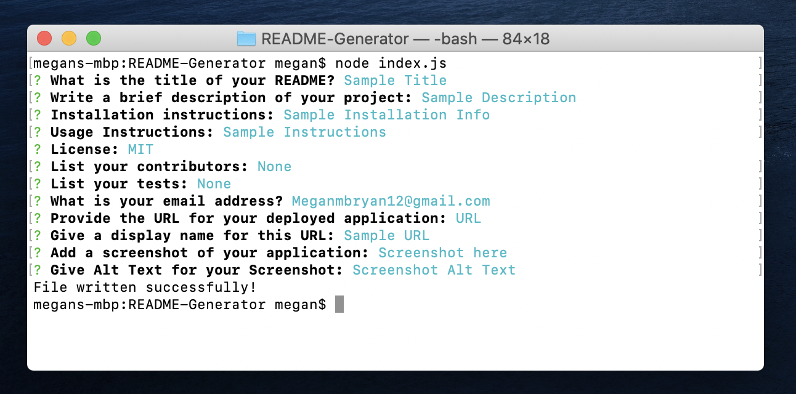

# README-Generator
### This project can be used with Node.js to generate a good README.md file.

### This involved two JavaScript files, and utilizes the Inquirer Module. One JS file directs/receives user input using Inquirer prompts, and sends this information to the other file to synthesize the user input into a README template. Once their answers are processed, a styled README file is produced. This application cannot be deployed, so I have recorded a video displaying its functionality.

### [Example Video](https://drive.google.com/file/d/1wi9MD8iYDrozVO81QARKsmwFjqUnmfSc/view)
### [Example Produced README](./SampleREADME/README.md)
### Screenshot of terminal: 
