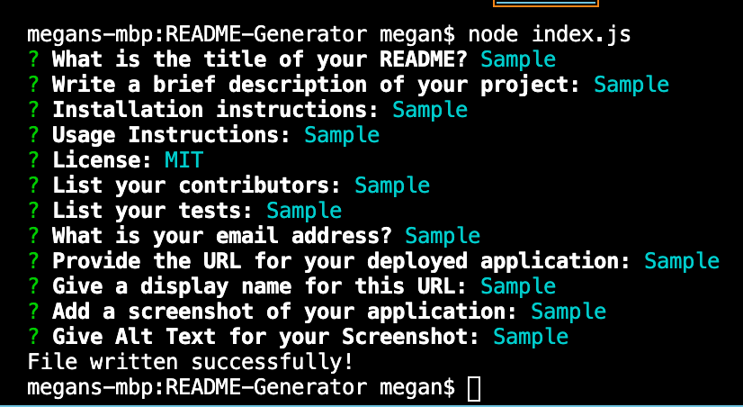

# Test 2
  ## Description
  ###   This is a secondary test.
  
  ## Table of Contents
    1. [Installation](#installation)
    2. [Usage](#usage)
    3. [License](#license)
    4. [Contributing](#contributing)
    5. [Tests](#tests)
    6. [Questions](#questions)
    7. [Link to Application](#link)
    8. [Screenshot of Application](#screenshot)

  ## Installation 
  ### Info here

  ## Usage 
  ### Info here

  ## License 
  ### MIT

  ## Contributing 
  ### None

  ## Tests 
  ### This

  ## Questions 
  ### [Click here to email me.](mailto:meganmbryan12@gmail.com)

  ## Link to Deployed Application: 
  ### [Not Applicable](Not Applicable) 
  ##  
